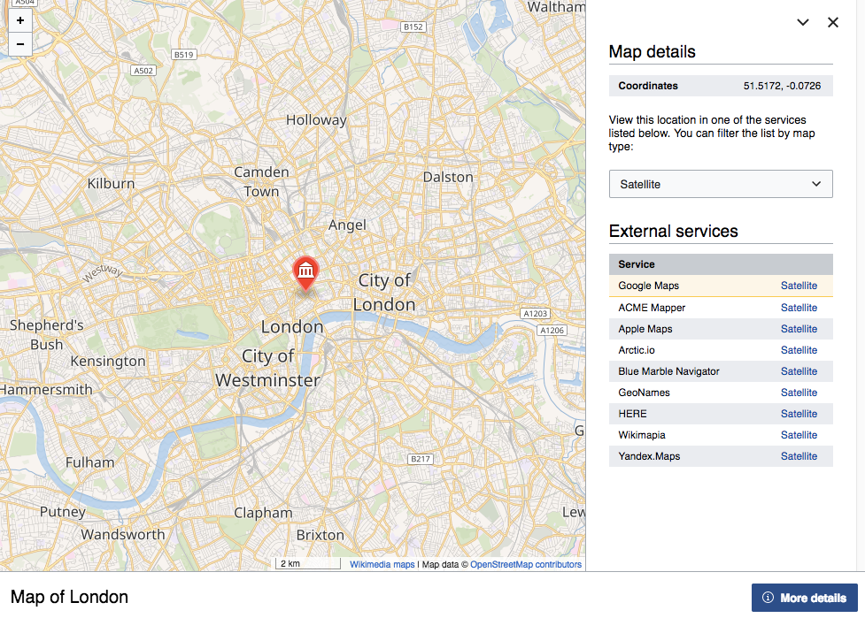
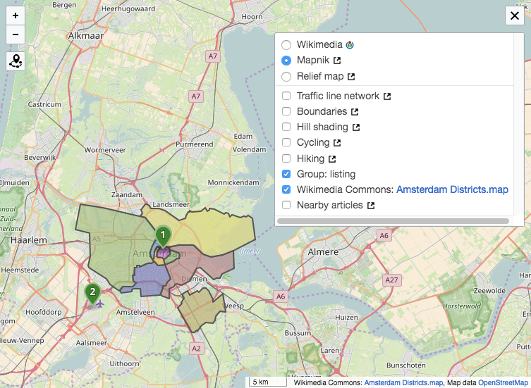
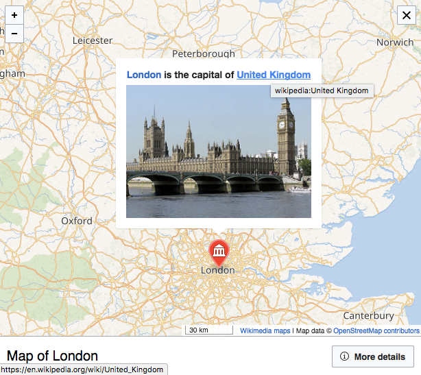

---
params:
  days: 90
title: "Interactions with Wikimedia Maps on Wikimedia projects"
author: "MPopov (WMF)"
date: "`r format(Sys.Date(), '%d %B %Y')`"
output:
  html_document:
    mathjax: https://tools-static.wmflabs.org/cdnjs/ajax/libs/mathjax/2.6.1/MathJax.js?config=TeX-AMS-MML_HTMLorMML
    md_extensions: +raw_html +markdown_in_html_blocks +tex_math_dollars +fancy_lists +startnum +lists_without_preceding_blankline -autolink_bare_uris
    theme: readable
    toc: yes
    code_folding: hide
---
```{r setup, echo=FALSE, message=FALSE, warning=FALSE}
knitr::opts_chunk$set(message = FALSE, warning = FALSE)
library(printr)
library(magrittr)
library(ggplot2)
```
```{css fonts, echo=FALSE}
@import url('https://fonts.googleapis.com/css?family=Source+Code+Pro|Source+Sans+Pro|Source+Serif+Pro');
body, p {
  font-family: 'Source Serif Pro', serif;
}
pre, code {
  font-family: 'Source Code Pro', monospace;
}
table, tr, td, h1, h2, h3, h4, h5, h6 {
  font-family: 'Source Sans Pro', sans-serif;
}
```
This is a report on user interactions with [Wikimedia Maps](https://www.mediawiki.org/wiki/Maps) usage across [Wikimedia Projects](https://wikimediafoundation.org/wiki/Our_projects) via [Schema:Kartographer](https://meta.wikimedia.org/wiki/Schema:Kartographer) event logging implemented by [Julien Girault](https://meta.wikimedia.org/wiki/User:JGirault_(WMF)) (see [T163139](https://phabricator.wikimedia.org/T163139) for more details). It is a companion to the report on _[Wikimedia Maps usage on Wikimedia projects](https://people.wikimedia.org/~bearloga/reports/maps-usage.html)_.

## Data

```{r connect, eval=TRUE, echo=FALSE}
# https://people.wikimedia.org/~bearloga/notes/rnotebook-eventlogging.html
library(RMySQL)
con <- dbConnect(MySQL(), host = "127.0.0.1", group = "client", dbname = "log", port = 3307)
knitr::opts_chunk$set(connection = con)
```
```{r build_query, echo=FALSE}
if (exists("params")) {
  start_date <- format(Sys.Date() - 1 - params$days, "%Y%m%d")
} else {
  start_date <- format(Sys.Date() - 8, "%Y%m%d")
}
end_date <- format(Sys.Date() - 1, "%Y%m%d")
query <- glue::glue("SELECT
  DATE(TIMESTAMP) AS `date`,
  TIMESTAMP AS ts, wiki,
  event_feature AS feature,
  event_action AS `event`,
  event_extra AS extras,
  event_duration AS duration,
  event_firstInteraction AS first_interaction,
  event_fullscreen AS fullscreen,
  event_mobile AS mobile,
  event_userToken AS user_token
FROM Kartographer_16132745
WHERE
  LEFT(TIMESTAMP, 8) >= '{start_date}'
  AND LEFT(timestamp, 8) <= '{end_date}'")
```
```{sql query, code=query, eval=FALSE, echo=TRUE}
```
```{r fetch, eval=TRUE, cache=TRUE}
results <- wmf::mysql_read(query, "log", con)
results$first_interaction <- results$first_interaction == 1
results$fullscreen <- results$fullscreen == 1
results$mobile <- results$mobile == 1
results$date <- lubridate::ymd(results$date)
results$ts <- lubridate::ymd_hms(results$ts)
results <- cbind(
  dplyr::select(results, wiki, user_token, ts, date, feature, event, duration, first_interaction, fullscreen, mobile),
  purrr::map_df(
    results$extras,
    ~ as.data.frame(jsonlite::fromJSON(.x, simplifyVector = FALSE),
                    stringsAsFactors = FALSE)
))
results$layer %<>% forcats::fct_recode(
  "Relief map" = "Reliefkarte",
  "Hill shading" = "Schummerung",
  "Traffic line network" = "Verkehrsliniennetz",
  "Hiking" = "Wanderwege",
  "Boundaries" = "Grenzen"
)
results$service %<>% forcats::fct_recode(
  "Google Maps" = "google-maps",
  "Apple Maps" = "apple-maps",
  "Yandex.Maps" = "yandex-maps",
  "Bing Maps" = "bing-maps",
  "Wikimapia" = "wikimapia",
  "GeoHack" = "geohack",
  "GeoNames" = "geonames",
  "OpenStreetMap" = "openstreetmap",
  "HERE" = "here",
  "MapQuest" = "mapquest",
  "WikiMiniAtlas" = "wikiminiatlas",
  "Waze" = "waze",
  "ACME Mapper" = "acme-mapper",
  "Blue Marble Navigator" = "blue-marble-navigator",
  "Arctic.io" = "arctic-io",
  "SkyVector" = "skyvector"
)
results$type <- polloi::capitalize_first_letter(results$type)
results <- results[order(results$wiki, results$user_token, results$ts), ]
```
```{r disconnect, eval=TRUE, include=FALSE}
dbDisconnect(con)
```
```{r data.table}
lang_proj <- polloi::get_langproj() # polloi::update_prefixes()
results <- dplyr::left_join(
  results,
  lang_proj,
  by = c("wiki" = "wikiid")
)
events <- data.table::data.table(results, key = c("wiki", "user_token"))
rm(results, lang_proj) # cleanup
```
```{r summary}
DT::datatable(
  events[, list(events = .N), by = c("language", "project", "date", "mobile", "user_token")][, list(
    sessions = .N,
    events = sum(events),
    mobile_prop = mean(mobile)
  ), by = c("language", "project", "date")][, list(
    `sessions/day` = median(sessions),
    `events/day` = median(events),
    `% of sessions on mobile` = median(mobile_prop)
  ), by = c("language", "project")],
  caption = paste("This shows median counts of sessions and events across from the past", params$days, "days."),
  filter = "top",
  extensions = "Buttons",
  options = list(
    pageLength = 10, autoWidth = TRUE, language = list(search = "Filter:"),
    order = list(list(3, "desc")), dom = "Bfrtip", buttons = c("copy", "csv")
  )
) %>%
  DT::formatPercentage("% of sessions on mobile", 1) %>%
  DT::formatCurrency(
    columns = c("sessions/day", "events/day"),
    currency = "", digits = 0
  )
```

## Interactions

### External services sidebar



```{r sidebar_show}
events[!project %in% c("MediaWiki", "Wikimedia Chapter", "Wikimedia Foundation wiki", "Wikinews", "Wiktionary", "Meta wiki", "Wikidata"),
       list(interacted = any(event %in% c("sidebar-show", "sidebar-hide", "sidebar-type", "sidebar-click"))),
       by = c("project", "wiki", "user_token", "date")] %>%
  .[, list(`% interacted` = 100 * sum(interacted) / .N), by = c("date", "project")] %>%
  tidyr::spread(project, `% interacted`, fill = 0) %>%
  { xts::xts(.[, -1], order.by = .$date) } %>%
  dygraphs::dygraph(
    xlab = "Date", ylab = "% of sessions",
    main = "Proportion of sessions that have interacted with the sidebar",
    width = 900
  ) %>%
  dygraphs::dyOptions(drawPoints = TRUE, pointSize = 2) %>%
  dygraphs::dyLegend(labelsDiv = "sidebar-legend", width = 900) %>%
  dygraphs::dyAxis("x", axisLabelFormatter = polloi::custom_axis_formatter) %>%
  dygraphs::dyAxis(
    "y",
    axisLabelFormatter = "function(x) { return x + '%'; }",
    valueFormatter = "function(x) { return (Math.round(x*100)/100) + '%'; }"
  )
```
<div id="sidebar-legend" style="margin-top: 25px;"></div>
```{r sidebar_switch}

```
```{r external_services}
DT::datatable(
  events[!is.na(type) & !is.na(service),
         list(events = .N),
         by = c("type", "service")] %>%
    tidyr::spread(type, events, fill = 0),
  caption = paste("This table shows the total number of clicks on external services from the last", params$days, "days."),
  filter = "top",
  extensions = "Buttons",
  options = list(
    pageLength = 20, autoWidth = TRUE, language = list(search = "Filter:"),
    order = list(list(3, "desc")), dom = "Bfrtip", buttons = c("copy", "csv")
  )
) %>%
  DT::formatCurrency(
    columns = c("Aerial", "Map", "Other", "Satellite", "Terrain", "Topo"),
    currency = "", digits = 0
  )
```

### External layers



```{r external_layers, cache=TRUE}
n_sessions <- data.table::uniqueN(events[date >= "2017-08-04", c("wiki", "user_token")])
external_layers <- events[
  grepl("exlayer$", event) &
    !is.na(layer) &
    date >= "2017-08-04",
  list(events = .N),
  by = c("wiki", "user_token", "layer", "event")
  ] %>%
  .[, list(
    sessions = length(unique(user_token)) / n_sessions
  ), by = c("event", "layer")] %>%
  dplyr::mutate(event = dplyr::case_when(
    event == "wv-select-exlayer" ~ "Switched to external (non-WMF) layer",
    event == "wv-show-exlayer" ~ "External layer was enabled",
    event == "wv-hide-exlayer" ~ "External layer was hidden"
  ))
ggplot(external_layers, aes(x = layer, y = sessions, fill = event)) +
  geom_bar(stat = "identity", position = "dodge") +
  scale_y_continuous(labels = scales::percent_format()) +
  scale_fill_brewer("Interaction", palette = "Set1") +
  labs(
    x = "Layer", y = "Proportion of total sessions",
    title = "Usage of external layers",
    subtitle = "Using data from 4 August 2017 through 21 August 2017"
  ) +
  wmf::theme_min(base_family = "Open Sans")
```

### Page Discovery



There are three possible links the user can click on on a Map:

- **_external_** links take a user outside of Wikimedia projects
- **_internal_** links take a user to a page on the same wiki
- **_interwiki_** links take a user to a page on a different wiki

```{r discovery}
# discovery: user goes to another page thanks to this feature
DT::datatable(
  events[event == "discovery",
         list(events = .N),
         by = c("language", "project", "destination", "feature")] %>%
    tidyr::spread(destination, events, fill = 0),
  caption = paste("This table shows the total number of clicks to other pages from a maplink/mapframe across the last", params$days, "days."),
  filter = "top",
  extensions = "Buttons",
  options = list(
    pageLength = 20, autoWidth = TRUE, language = list(search = "Filter:"),
    order = list(list(3, "desc")), dom = "Bfrtip", buttons = c("copy", "csv")
  )
)
```

# Appendix

## Setup

This report was compiled using [RMarkdown](http://rmarkdown.rstudio.com/), [knitr](https://yihui.name/knitr/), and an open SSH tunnel for connecting to our databases:

```
ssh -N stat3 -L 3307:analytics-store.eqiad.wmnet:3306
```
