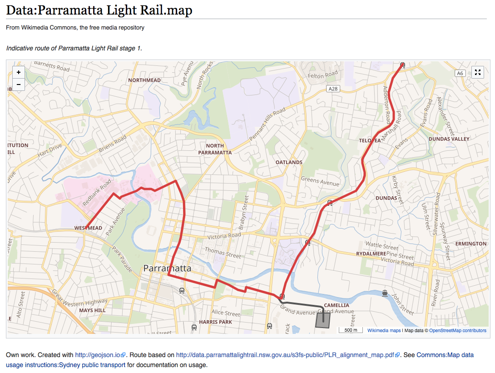

```{r setup, echo=FALSE, message=FALSE, warning=FALSE}
knitr::opts_chunk$set(message = FALSE, warning = FALSE)
library(printr)
library(magrittr)
# library(ggplot2)
library(rbokeh)
library(RMySQL)
dbs <- readr::read_lines("db.txt")
language_projects <- polloi::get_langproj()
language_projects <- paste0(
  ifelse(is.na(language_projects$language), "", paste0(language_projects$language, " ")),
  language_projects$project
) %>%
  set_names(language_projects$wikiid)
```
```{css}
@import url('https://fonts.googleapis.com/css?family=Source+Code+Pro|Source+Sans+Pro|Source+Serif+Pro');
body, p {
  font-family: 'Source Serif Pro', serif;
}
pre, code {
  font-family: 'Source Code Pro', monospace;
}
table, tr, td, h1, h2, h3, h4, h5, h6 {
  font-family: 'Source Sans Pro', sans-serif;
}
```
This is a report on [Wikimedia Maps](https://www.mediawiki.org/wiki/Maps) usage across [Wikimedia Projects](https://wikimediafoundation.org/wiki/Our_projects).

## Maps usage on Wikimedia Projects

### Mapframe Inclusion

According to [the MediaWiki Maps page](https://www.mediawiki.org/wiki/Maps#Wikimedia_projects_that_have_Maps_enabled), the following wikis have Maps enabled with mapframes (maplinks are enabled on all wikis):

- [Metawiki](https://meta.wikimedia.org/)
- [MediaWiki](https://www.mediawiki.org/)
- [Wikivoyage](https://www.wikivoyage.org/) (all languages)
- Wikipedia:
    - [Catalan](https://ca.wikipedia.org/)
    - [Hebrew](https://he.wikipedia.org/)
    - [Russian](https://ru.wikipedia.org/)
    - [Macedonian](https://mk.wikipedia.org/)
    - [French](https://fr.wikipedia.org/)
    - [Finnish](https://fi.wikipedia.org)
    - [Norwegian](https://no.wikipedia.org/)
    - [Swedish](https://sv.wikipedia.org/)

Let's count how many articles on those wikis have mapframes. Some articles have more than one mapframe, so we also counted the total number of mapframes.

```{r mapframes_data, cache=TRUE}
# dbs is a list of databases in analytics-store
wikivoyages <- grep("voyage$", dbs, value = TRUE)
wikipedias <- c("cawiki", "hewiki", "ruwiki", "mkwiki", "frwiki", "fiwiki", "nowiki", "svwiki")
other_projects <- c("metawiki", "mediawikiwiki")
query <- "SELECT
  COUNT(*) AS `total articles`,
  SUM(IF(mapframes > 0, 1, 0)) AS `articles with a mapframe`,
  SUM(COALESCE(mapframes, 0)) AS `total mapframes`,
  SUM(IF(mapframes > 0, 1, 0))/COUNT(*) AS `mapframe prevalence`
FROM (
  SELECT
    page.page_id,
    pp_value AS mapframes
  FROM (
    SELECT pp_page, pp_value
    FROM page_props
    WHERE pp_propname = 'kartographer_frames' AND pp_value > 0
  ) AS filtered_props
  RIGHT JOIN page ON page.page_id = filtered_props.pp_page AND page.page_namespace = 0
) joined_tables;"
mapframes <- lapply(c(wikivoyages, wikipedias, other_projects), function(db) {
  message("Fetching mapframe statistics from ", db, "...")
  con <- dbConnect(MySQL(), host = "127.0.0.1", group = "client", dbname = db, port = 3307)
  suppressWarnings(result <- wmf::mysql_read(query, db, con = con))
  invisible(dbDisconnect(con))
  return(result)
})
mapframes <- dplyr::bind_rows(mapframes)
rownames(mapframes) <- language_projects[c(wikivoyages, wikipedias, other_projects)]
```

Below are the results as of 17 July 2017:

```{r mapframes_table}
DT::datatable(
  mapframes,
  caption = "This shows the prevalence of mapframes on wikis that have it enabled.",
  filter = "top",
  extensions = "Buttons",
  options = list(
    pageLength = 10, autoWidth = TRUE, language = list(search = "Filter:"),
    order = list(list(4, "desc")), dom = "Bfrtip", buttons = c("copy", "csv")
  )
) %>%
  DT::formatPercentage("mapframe prevalence", 3) %>%
  DT::formatCurrency(
    columns = c("total articles", "articles with a mapframe", "total mapframes"),
    currency = "", digits = 0
  )
```

<br>

The mean prevalence across mapframe-enabled wikis is `r sprintf("%.2f%%", 100 * mean(mapframes$"mapframe prevalence"))`. The median prevalence across mapframe-enabled wikis is `r sprintf("%.2f%%", 100 * median(mapframes$"mapframe prevalence"))`. Overall prevalence is `r sprintf("%.2f%%", 100 * sum(mapframes$"articles with a mapframe")/sum(mapframes$"total articles"))`.

### Maplink Inclusion {.tabset}

#### All

Let's count how many articles across Wikipedia, Wikivoyage, Meta, and MediaWiki have maplinks. Some articles have more than one maplink, so we also counted the total number of maplinks.

```{r maplinks_data, cache=TRUE}
# dbs is a list of databases in analytics-store
wikis <- grep("wiki$", dbs, value = TRUE)
wikis <- wikis[!grepl("^((wikimania)|(test)|(login)|(transition)|(arbcom))", wikis)]
wikis <- Reduce(union, list(wikis, wikivoyages, wikipedias, other_projects, "specieswiki"))
wikis <- wikis[wikis %in% names(language_projects)]
query <- "SELECT
  COUNT(*) AS `total articles`,
  SUM(IF(maplinks > 0, 1, 0)) AS `articles with a maplink`,
  SUM(COALESCE(maplinks, 0)) AS `total maplinks`,
  SUM(IF(maplinks > 0, 1, 0))/COUNT(*) AS `maplink prevalence`
FROM (
  SELECT
    page.page_id,
    pp_value AS maplinks
  FROM (
    SELECT pp_page, pp_value
    FROM page_props
    WHERE pp_propname = 'kartographer_links' AND pp_value > 0
  ) AS filtered_props
  RIGHT JOIN page ON page.page_id = filtered_props.pp_page AND page.page_namespace = 0
) joined_tables;"
maplinks <- lapply(wikis, function(db) {
  message("Fetching maplink statistics from ", db, "...")
  con <- dbConnect(MySQL(), host = "127.0.0.1", group = "client", dbname = db, port = 3307)
  suppressWarnings(result <- wmf::mysql_read(query, db, con = con))
  invisible(dbDisconnect(con))
  return(result)
})
maplinks <- dplyr::bind_rows(maplinks)
rownames(maplinks) <- language_projects[wikis]
```

Below are the results as of 17 July 2017:

```{r maplinks_table}
DT::datatable(
  maplinks,
  caption = "This shows the prevalence of maplinks on wikis.",
  filter = "top",
  extensions = "Buttons",
  options = list(
    pageLength = 10, autoWidth = TRUE, language = list(search = "Filter:"),
    order = list(list(4, "desc")), dom = "Bfrtip", buttons = c("copy", "csv")
  )
) %>%
  DT::formatPercentage("maplink prevalence", 3) %>%
  DT::formatCurrency(
    columns = c("total articles", "articles with a maplink", "total maplinks"),
    currency = "", digits = 0
  )
```

<br>

The average prevalence across wikis is `r sprintf("%.2f%%", 100 * mean(maplinks$"maplink prevalence"))`. The median prevalence across wikis is `r sprintf("%.2f%%", 100 * median(maplinks$"maplink prevalence"))`. Overall prevalence is `r sprintf("%.2f%%", 100 * sum(maplinks$"articles with a maplink")/sum(maplinks$"total articles"))`.

#### Wikipedia

```{r maplinks_wikipedia}
DT::datatable(
  maplinks[grepl("Wikipedia$", rownames(maplinks)), ],
  caption = "This shows the prevalence of maplinks on Wikipedia.",
  filter = "top",
  extensions = "Buttons",
  options = list(
    pageLength = 10, autoWidth = TRUE, language = list(search = "Filter:"),
    order = list(list(4, "desc")), dom = "Bfrtip", buttons = c("copy", "csv")
  )
) %>%
  DT::formatPercentage("maplink prevalence", 3) %>%
  DT::formatCurrency(
    columns = c("total articles", "articles with a maplink", "total maplinks"),
    currency = "", digits = 0
  )
```

#### Wikivoyage

```{r maplinks_wikivoyage}
DT::datatable(
  maplinks[grepl("Wikivoyage$", rownames(maplinks)), ],
  caption = "This shows the prevalence of maplinks on Wikivoyage.",
  filter = "top",
  extensions = "Buttons",
  options = list(
    pageLength = 10, autoWidth = TRUE, language = list(search = "Filter:"),
    order = list(list(4, "desc")), dom = "Bfrtip", buttons = c("copy", "csv")
  )
) %>%
  DT::formatPercentage("maplink prevalence", 3) %>%
  DT::formatCurrency(
    columns = c("total articles", "articles with a maplink", "total maplinks"),
    currency = "", digits = 0
  )
```

#### Miscellaneous

```{r maplinks_misc}
DT::datatable(
  maplinks[rownames(maplinks) %in% c("MediaWiki", "Meta wiki", "Wikispecies"), ],
  caption = "This shows the prevalence of maplinks on MediaWiki, Meta wiki, and Wikispecies.",
  filter = "top",
  extensions = "Buttons",
  options = list(
    pageLength = 10, autoWidth = TRUE, language = list(search = "Filter:"),
    order = list(list(4, "desc")), dom = "Bfrtip", buttons = c("copy", "csv")
  )
) %>%
  DT::formatPercentage("maplink prevalence", 3) %>%
  DT::formatCurrency(
    columns = c("total articles", "articles with a maplink", "total maplinks"),
    currency = "", digits = 0
  )
```

## Maps usage on Wikimedia Commons

### Maps within Data namespace

[Map data](https://www.mediawiki.org/wiki/Help:Map_Data) allows users to store GeoJSON data on wiki, similar to images. [Search for *.map within Data namespace](https://commons.wikimedia.org/w/index.php?search=.map&title=Special:Search&profile=advanced&fulltext=1&ns486=1) and you get results like [Data:Parramatta Light Rail.map](https://commons.wikimedia.org/wiki/Data:Parramatta_Light_Rail.map):



Or if you [search for *.tab within Data namespace](https://commons.wikimedia.org/w/index.php?search=.tab&title=Special:Search&profile=advanced&fulltext=1&ns486=1), you'll get tabular datasets like [Data:Bea.gov/GDP by state.tab](https://commons.wikimedia.org/wiki/Data:Bea.gov/GDP_by_state.tab).

Let's see how many of those there are:

```{r commons_connect, echo=FALSE}
con <- dbConnect(MySQL(), host = "127.0.0.1", group = "client", dbname = "commonswiki", port = 3307)
```

(Query run on 17 July 2017.)

```{sql commons_query, connection=con, cache=TRUE}
SELECT
  CASE WHEN page_title RLIKE '\.map$' THEN 'map'
       WHEN page_title RLIKE '\.tab$' THEN 'tabular'
       ELSE 'other'
  END AS data,
  FORMAT(COUNT(*), 0) AS total
FROM page
WHERE page_namespace = 486
GROUP BY data;
```

### Geo-tags

In June 2016 we released Maps on Commons ([T138029](https://phabricator.wikimedia.org/T138029)). Users could add coordinates to files to geo-tag them. For example:

```{sql geo_tagged_pages, connection=con, cache=TRUE}
SELECT page_title AS file, gt_lat AS latitude, gt_lon AS longitude
FROM (
  SELECT gt_page_id, gt_lat, gt_lon
  FROM geo_tags
  WHERE gt_primary = 1 AND NOT (gt_lat = 0 AND gt_lon = 0)
  LIMIT 10
) geo_tagged
LEFT JOIN page
  ON geo_tagged.gt_page_id = page.page_id AND page.page_namespace = 6;
```

One way to consider usage is how many pages are geo-tagged vs not (query run on 17 July 2017):

```{sql geo_tags, connection=con, cache=TRUE}
SELECT
  FORMAT(COUNT(*), 0) AS `total files`,
  FORMAT(SUM(is_geotagged), 0) AS `geo-tagged files*`,
  CONCAT(ROUND(100*SUM(is_geotagged)/COUNT(*),2),'%') AS `proportion geo-tagged*`
FROM (
  SELECT
    page.page_id AS page_id,
    CASE WHEN filtered_geotags.geotagged = 'yes' THEN true
         WHEN filtered_geotags.geotagged IS NULL THEN false
    END AS is_geotagged
  FROM (
    SELECT gt_page_id, 'yes' AS geotagged
    FROM geo_tags
    WHERE gt_primary = 1
  ) AS filtered_geotags
  RIGHT JOIN page
    ON page.page_id = filtered_geotags.gt_page_id
    AND page.page_namespace = 6
    AND page.page_is_redirect = 0
) joined_tables
```

__\*__ This is actually overcounting because there is a known issue ([T143366](https://phabricator.wikimedia.org/T143366)) where the **geo_tags** table (List of pages' geographical coordinates) is updated when coordinates are added to a page, but not updated when the coordinates are removed. It looks like the code that deals with **geo_tags** is part of the [GeoData extension](https://phabricator.wikimedia.org/diffusion/EGDA/) and [Wikidata extension](https://phabricator.wikimedia.org/diffusion/EWDA/) repositories (e.g. [GeoDataDataUpdater.php](https://phabricator.wikimedia.org/diffusion/EWDA/browse/master/extensions/Wikibase/repo/includes/ParserOutput/GeoDataDataUpdater.php)).

### Maplinks and Mapframes

[Mapframes](https://www.mediawiki.org/wiki/Help:Extension:Kartographer#.3Cmapframe.3E_usage) and [maplinks](https://www.mediawiki.org/wiki/Help:Extension:Kartographer#.3Cmaplink.3E) are two ways that Wikimedia Maps can be included on a page when the [Kartographer extension](https://www.mediawiki.org/wiki/Extension:Kartographer) is enabled. Maplinks are also added to a page automatically through [coordinates](https://commons.wikimedia.org/wiki/Module:Coordinates), [Object Location](https://commons.wikimedia.org/wiki/Template:Object_location), and [Location](https://commons.wikimedia.org/wiki/Template:Location) templates as part of [geocoding on Commons](https://commons.wikimedia.org/wiki/Commons:Geocoding). For example, as of 14 July 2017, [File:RNV HEAG-Dampf Schleifenbogen 1.JPG](https://commons.wikimedia.org/wiki/File:RNV_HEAG-Dampf_Schleifenbogen_1.JPG) includes a mapframe in the description, and [File:Paddestoel 003.jpg](https://commons.wikimedia.org/wiki/File:Paddestoel_003.jpg) includes camera location which results in a maplink.

, available under [Free Art License](https://en.wikipedia.org/wiki/en:Free_Art_License)) having a mapframe. **Right**: an example of a photo (by [Andre Engels](https://commons.wikimedia.org/wiki/User:Andre_Engels), available under Creative Commons [Attribution 1.0 Generic](https://creativecommons.org/licenses/by/1.0/deed.en) license) with a camera location attached, resulting in a maplink.](figures/commons.png)

(Query run on 17 July 2017.)

```{sql commons_map_prevalence, connection=con, cache=TRUE}
SELECT
  FORMAT(COUNT(*), 0) AS `total files`,
  FORMAT(SUM(IF(mapframes > 0, 1, 0)), 0) AS `files with a mapframe`,
  CONCAT(ROUND(100*SUM(IF(mapframes > 0, 1, 0))/COUNT(*),2),'%') AS `mapframe prevalence`,
  FORMAT(SUM(mapframes), 0) AS `total mapframes`,
  FORMAT(SUM(IF(maplinks > 0, 1, 0)), 0) AS `files with a maplink`,
  CONCAT(ROUND(100*SUM(IF(maplinks > 0, 1, 0))/COUNT(*),2),'%') AS `maplink prevalence`,
  FORMAT(SUM(maplinks), 0) AS `total maplinks`
FROM (
  SELECT
    page_id,
    SUM(IF(type = 'mapframe', instances, 0)) AS mapframes,
    SUM(IF(type = 'maplink', instances, 0)) AS maplinks
  FROM (
    SELECT page.page_id,
      CASE kartographer.pp_propname
           WHEN 'kartographer_frames' THEN 'mapframe'
           WHEN 'kartographer_links' THEN 'maplink'
      END AS type,
      kartographer.pp_value AS instances
    FROM (
      SELECT * FROM page_props
      WHERE pp_propname IN('kartographer_frames', 'kartographer_links') AND pp_value > 0
    ) AS kartographer
    RIGHT JOIN page ON page.page_id = kartographer.pp_page AND page.page_namespace = 6
  ) AS joined_tables
  GROUP BY page_id
) counts;
```

Approximately 17% (9.5M) of 56M files on Commons include a maplink.

```{r commons_disconnect, echo=FALSE}
invisible(dbDisconnect(con))
```

# Appendix

## Setup

This report was compiled using [RMarkdown](http://rmarkdown.rstudio.com/), [knitr](https://yihui.name/knitr/), and an open SSH tunnel for connecting to our databases:

```
ssh -N stat3 -L 3307:analytics-store.eqiad.wmnet:3306
```

## Notes

When figuring stuff out (e.g. what it looks like in the database when a page has a map) and working with page IDs, the [MediaWiki API](https://www.mediawiki.org/wiki/API:Main_page) can be used to get a page title from a page ID:

```
https://commons.wikimedia.org/w/api.php?action=query&prop=revisions&rvprop=content&format=jsonfm&pageids=ID1|ID2
```
